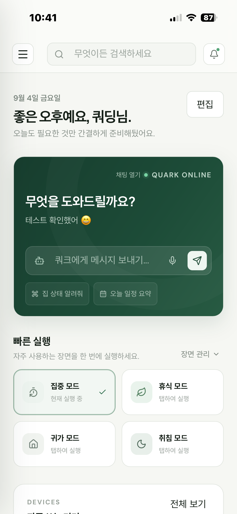
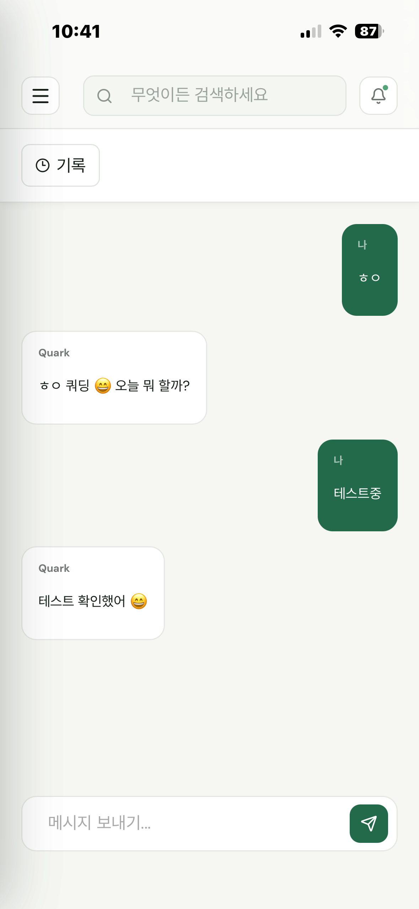
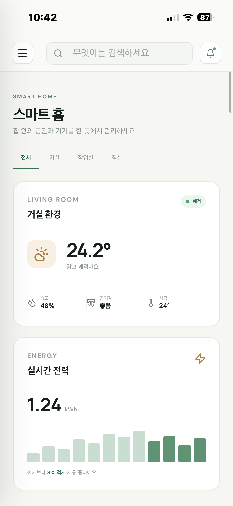
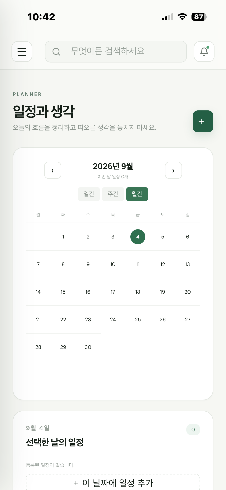
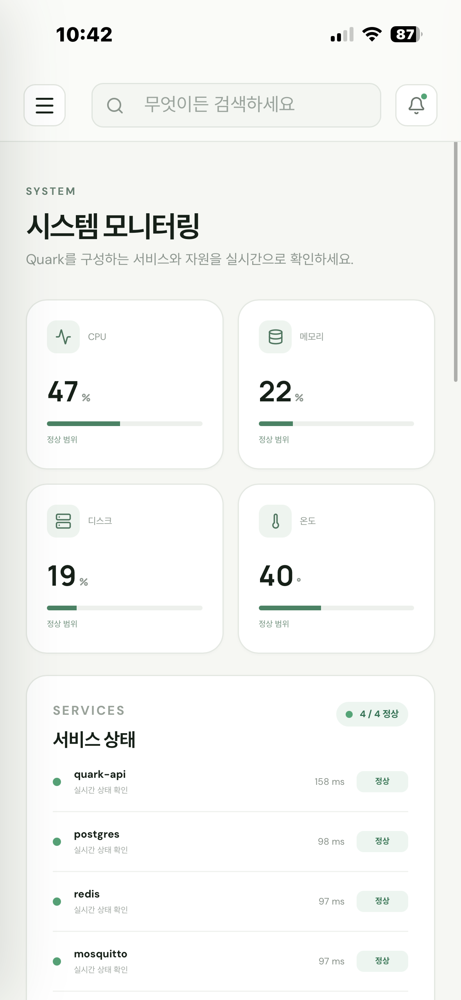
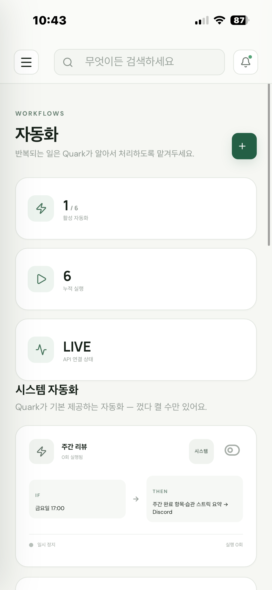
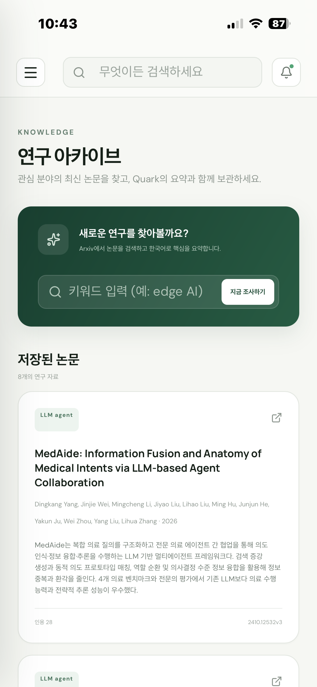
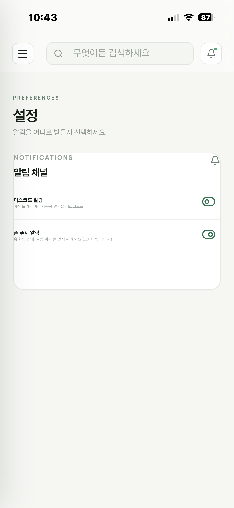

# QUARK

**개인용 AI 비서 + 홈 자동화 통합관제 시스템.** N100 미니PC에서 자체 호스팅되며, 단일 AI 에이전트가 Discord·웹(PWA)·Siri 세 채널을 통해 집 제어, 일정 관리, 시스템 모니터링, 알림을 처리합니다.

<p align="center"></p>

---

## 목차

- [한눈에 보기](#한눈에-보기)
- [기술 스택](#기술-스택)
- [아키텍처](#아키텍처)
- [기능](#기능)
  - [AI 채팅](#ai-채팅)
  - [스마트 홈 제어](#스마트-홈-제어)
  - [일정 & 생활 트래커](#일정--생활-트래커)
  - [시스템 모니터링](#시스템-모니터링)
  - [자동화](#자동화)
  - [연구 아카이브](#연구-아카이브)
  - [알림 (Discord + 웹 푸시)](#알림-discord--웹-푸시)
  - [PWA — 홈 화면 앱](#pwa--홈-화면-앱)
- [디렉토리 구조](#디렉토리-구조)
- [시작하기](#시작하기)
- [테스트](#테스트)

---

## 한눈에 보기

QUARK는 "집 제어 대시보드 + AI 비서"를 한 시스템으로 합친 개인 프로젝트입니다.

- **단일 에이전트 구조** — 여러 개의 특화 에이전트로 나누지 않고, Pydantic AI 기반 에이전트 하나(`quark_agent`)에 도구(tool)를 등록하는 방식으로 모든 기능을 확장합니다.
- **채널 3개, 백엔드 하나** — Discord 봇, 웹 대시보드(SSE 스트리밍 채팅), Siri 단축어가 같은 FastAPI 백엔드와 같은 에이전트를 공유합니다.
- **자체 호스팅** — 클라우드 서비스 없이 N100 미니PC 한 대에서 Docker Compose로 전부 돌아갑니다. 외부 접속은 Cloudflare Tunnel로만 열립니다.
- **PWA** — 웹 UI를 iPhone 홈 화면에 앱처럼 설치할 수 있고, 웹 푸시 알림도 지원합니다.

## 기술 스택

| 영역 | 스택 |
|---|---|
| AI 에이전트 | [Pydantic AI](https://ai.pydantic.dev/), OpenAI (모델은 메시지 복잡도에 따라 자동 라우팅) |
| 백엔드 | FastAPI, SQLAlchemy 2.0(async), Alembic, PostgreSQL + pgvector, Redis |
| 홈 자동화 | MQTT(Mosquitto), 정규식 기반 1차 규칙 엔진(`rule_router`), APScheduler(고정 크론) |
| 봇/채널 | discord.py 2.7 (Cogs, 슬래시 커맨드, 영속 버튼), SSE 스트리밍, Siri 단축어 웹훅 |
| 프론트엔드 | React 19, TypeScript, Zustand, TanStack Query, Vite |
| PWA | Web App Manifest, Service Worker, Web Push(VAPID) |
| 인프라 | Docker Compose, Nginx, Cloudflare Tunnel, N100 미니PC 자체 호스팅 |

## 아키텍처

```
                         ┌──────────────────────┐
                         │   quark_agent (단일)   │
                         │  Pydantic AI + tools  │
                         └──────────┬────────────┘
              ┌──────────────────────┼──────────────────────┐
              │                      │                      │
        ┌─────▼─────┐        ┌───────▼───────┐        ┌─────▼─────┐
        │  Discord   │        │  웹 (PWA)      │        │   Siri     │
        │  Bot/Cogs  │        │  SSE 스트리밍   │        │  단축어    │
        └─────┬─────┘        └───────┬───────┘        └─────┬─────┘
              └──────────────────────┼──────────────────────┘
                                      │
                            ┌─────────▼─────────┐
                            │   FastAPI 백엔드    │
                            └─────────┬─────────┘
        ┌───────────┬───────────┬────┴────┬───────────┬───────────┐
        │            │           │         │           │           │
   ┌────▼───┐  ┌─────▼────┐ ┌───▼───┐ ┌───▼────┐ ┌────▼─────┐ ┌───▼────┐
   │Postgres│  │  Redis   │ │ MQTT  │ │Discord │ │ Web Push │ │  기타   │
   │+pgvector│  │(대화캐시)│ │(집제어)│ │REST API│ │ (VAPID)  │ │외부 API │
   └────────┘  └──────────┘ └───────┘ └────────┘ └──────────┘ └────────┘
```

## 기능

### AI 채팅

ChatGPT/Claude 웹처럼 대화가 자동으로 저장되고, 지난 대화 목록을 열어서 이어볼 수 있습니다. 새로고침해도 세션이 유지됩니다.

<p align="center"></p>

- SSE 기반 실시간 스트리밍 응답
- 대화 내용 Postgres에 영구 저장 + 지난 대화 목록 조회/전환/삭제
- pgvector 기반 장기기억(RAG) — 과거 대화에서 중요한 사실을 임베딩해 저장하고, 관련 있을 때 자동으로 문맥에 주입
- 모바일에서는 대화 목록이 드로어로 열림

### 스마트 홈 제어

<p align="center"></p>

- 장면(집중/휴식/귀가/취침) 실행, 조명·에어컨·LED 개별 제어 — 전부 MQTT로 실제 기기에 명령 전송
- 가전 목록·상태 표시
- MQTT 토픽 규칙: `quark/{type}/{device-id}/{metric}`

### 일정 & 생활 트래커

<p align="center"></p>

- Google Calendar 연동 일정, 할 일, 습관, 아이디어, 메모
- 일간·주간·월간 캘린더 뷰 전환
- 기분·수면·카페인 섭취 기록
- D-Day 관리, 알림(Alert) 목록 — 마감 임박·일정 충돌·회의 5분 전 등을 자동으로 채워줌

### 시스템 모니터링

<p align="center"></p>

- CPU/메모리/디스크/온도 실시간 통계
- Docker 컨테이너 상태, 서비스 헬스체크
- GitHub 커밋 잔디, OpenAI API 사용량(토큰)
- 미니PC 재부팅 · 노트북 Wake-on-LAN (둘 다 실수 클릭 방지용 확인창 포함)
- RAG 임베딩 on/off, 웹 푸시 알림 구독/테스트

### 자동화

<p align="center"></p>

두 종류의 자동화를 구분해서 보여줍니다.

- **시스템 자동화** — 아침 브리핑, 주간 리뷰, 커밋 리마인더, 습관 초기화, 식물 저수분 알림처럼 항상 등록되어 있는 것들. 켜고 끌 수만 있고 삭제는 불가 (삭제해도 실제 실행 코드가 없어지는 게 아니라서).
- **매크로** — 채팅으로 "이거 매크로로 저장해줘"라고 하면 만들어지는 사용자 정의 자동화. 나중에 이름으로 불러서 재실행 가능.

### 연구 아카이브

<p align="center"></p>

- 키워드로 Arxiv 논문을 검색 → LangGraph 파이프라인(수집 → 랭킹 → 필터 → 한국어 요약 → 저장)
- Semantic Scholar 인용수 기준 랭킹
- 저장된 논문은 채팅 툴 호출로도, 웹 페이지 버튼으로도 실행 가능

### 알림 (Discord + 웹 푸시)

<p align="center"></p>

- 자동화·알림이 발생하면 Discord와 웹 푸시(홈 화면 PWA) 양쪽으로 동시에 전송
- 설정 페이지에서 두 채널을 각각 독립적으로 켜고 끌 수 있음
- iOS 16.4+ 기준, 홈 화면에 추가된 PWA에 한해 실제 푸시 알림 수신 가능(Safari 탭 상태에서는 불가)

### PWA — 홈 화면 앱

- Web App Manifest + Service Worker로 iPhone 홈 화면에 네이티브 앱처럼 설치 가능
- 노치/Dynamic Island/홈 인디케이터 safe-area 대응
- 정적 자산만 최소 캐싱 — 채팅 SSE·MQTT·실시간 API는 서비스워커가 절대 가로채지 않음

## 디렉토리 구조

```
backend/app/
  agents/     quark_agent.py(단일 에이전트), routing.py(모델 자동 선택), deps.py
  tools/      assistant.py, home.py         ← 새 기능은 여기 등록형 함수로 추가
  routers/    chat, agenda, automations, push, system, siri, research ...
  services/   mqtt_bridge, rule_router, scheduler, notify, push, memory, rag ...
  models/     agenda, automation, chat, device, memory(pgvector), push, reminder
  discord/cogs/  reminder.py
frontend/src/
  pages/      QuarkPreview.tsx (홈/채팅/스마트홈/일정/모니터링/자동화/연구/설정)
  stores/     deviceStore, homeStore, uiStore, bridge
  hooks/      useQuarkChat, useMqtt, useClock
```

## 시작하기

```bash
git clone https://github.com/quoding/quoding_quark_project.git
cd quoding_quark_project

cp .env.example .env        # 값 채우기
mkdir -p secrets            # 아래 파일들을 채워 넣기
# secrets/openai_api_key, secrets/discord_token, secrets/postgres_user,
# secrets/postgres_password, secrets/redis_password, secrets/mqtt_user,
# secrets/mosquitto_password 등 — .env.example 주석 참고

docker compose up -d
docker compose exec quark-api alembic upgrade head
```

## 테스트

```bash
cd backend && pytest -q          # 외부 호출은 전부 mock, 실제 네트워크 호출 없음
cd frontend && npm test          # Vitest
```

---

<div align="center">스크린샷 위치: <code>docs/images/</code> — 각 섹션 이미지 파일명은 위 코드에 쓰인 그대로(<code>home.png</code>, <code>chat.png</code> 등)입니다.</div>
